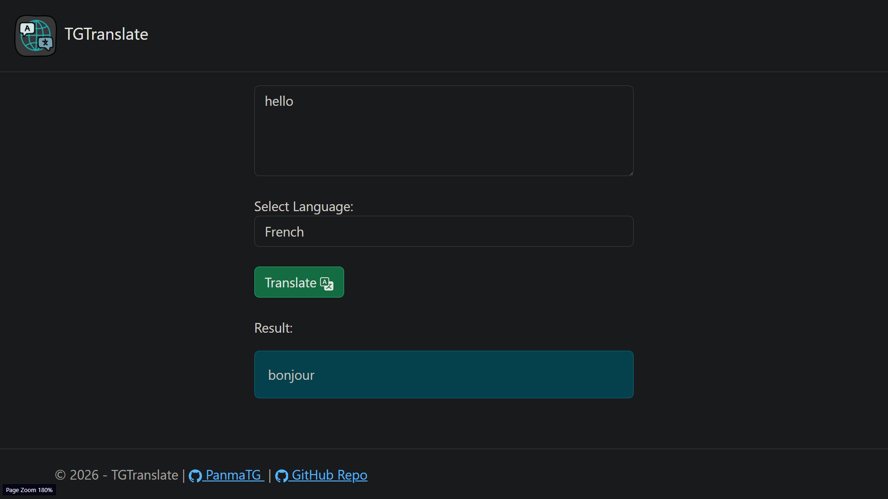
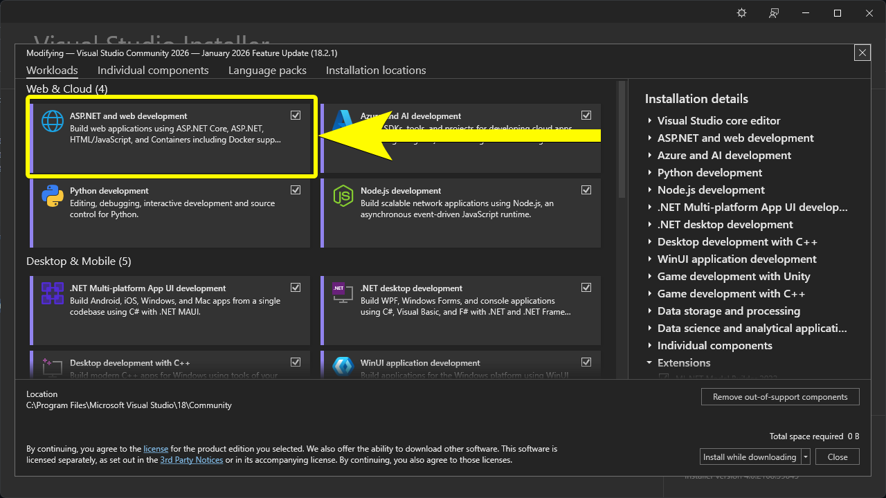

# TGTranslate
  

## Languages and Tools Used
  
  
  

## Setup (To Run Locally)
1. Clone this repository
    ```bash
    git clone https://github.com/PanmaTG/TGTranslate.git
    cd TGTranslate
    ```
2. Open the `TGTranslate.slnx` using Visual Studio.

    ```bash
    start TGTranslate.slnx
    ```

> [!IMPORTANT]  
> Make sure **ASP.NET and web developmen**t is installed.
> <br>
> 
    
3. Navigate to TGTranslate/appsettings.json
4. Input your **OpenAI API key**
```json
{
  "Logging": {
    "LogLevel": {
      "Default": "Information",
      "Microsoft.AspNetCore": "Warning"
    }
  },
  "OpenAI": {
    "ApiKey": "YOUR_OPENAI_API_KEY_HERE" // ← Input your OpenAI API key here.
  },
  "AllowedHosts": "*"
}
```
5. Open Developer Terminal (View → Terminal)
6. Install NuGet package "Newtonsoft.Json" by typing the following in Developer terminal
```bash
dotnet add package Newtonsoft.Json --version 13.0.4
```   
7. Run the project by clicking the **Start** or **Start Debugging button** or by pressing **F5**

## License
Code released under the MIT License <br/>
Copyright (c) 2026 **Built by @PanmaTG**
